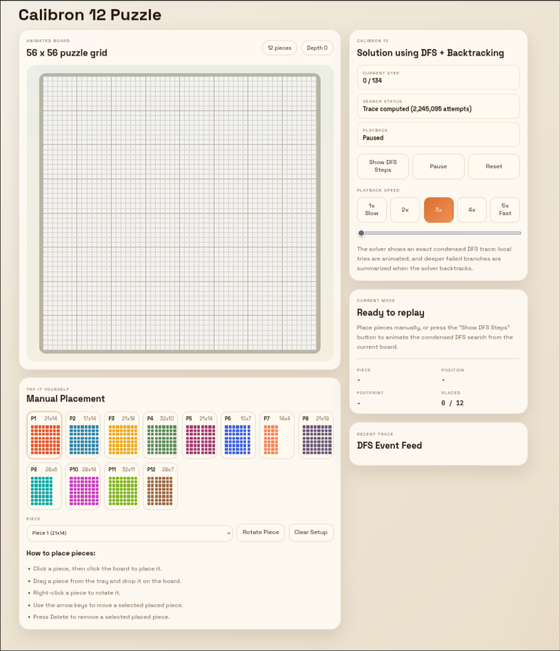

# Calibron 12 Puzzle Solver

This repo contains a C++ backtracking solver for the Calibron 12 puzzle and a small browser-based visualization that replays a condensed DFS trace of the solution process.

Live site: https://calibron12.vercel.app/



## Background

I got this puzzle as a Christmas gift in 2025 and quickly realized that solving it entirely by trial and error would take an absurd amount of time.

Calibron 12 is a packing puzzle where the goal is to fit 12 rectangular pieces into a single larger rectangle with no overlaps and no gaps. Each piece can be rotated, but every piece must be used exactly once.

If you treat the problem as trying every possible ordering of 12 pieces and 2 orientations per piece, you end up with:

```text
24 * 22 * 20 * ... * 2
= 2^12 * 12!
= 1,961,990,553,600
```

possible configurations.

Even **at roughly 30 seconds per attempt, it would take 1,865,191.71 years**, so I wrote a depth-first search solver with backtracking to find a valid arrangement instead.

## What Is In This Repo

- `calibron_solver.cpp`: a C++ solver for the 56 x 56 Calibron 12 board
- `index.html`, `styles.css`, `app.js`: a static frontend that visualizes a condensed DFS trace
- `calibron12img.png`: project image/favicon used by the frontend

## Puzzle Data

The board is `56 x 56`, and the solver/frontend use these 12 rectangular pieces:

```text
21 x 14
17 x 14
21 x 18
32 x 10
21 x 14
10 x 7
14 x 4
21 x 18
28 x 6
28 x 14
32 x 11
28 x 7
```

## Running The Solver

Compile the C++ solver:

```bash
g++ -std=c++17 calibron_solver.cpp -o calibron_solver
```

Run it:

```bash
./calibron_solver
```

The program prints:

- the completed board layout
- the placement order for the solved arrangement

## Viewing The Visualization

The visualization is also deployed on Vercel:

https://calibron12.vercel.app/

The frontend is fully static, so you can also open `index.html` directly in a browser or serve the folder with any simple local server.

If you want to use Python's built-in server:

```bash
python3 -m http.server
```

Then open `http://localhost:8000`.

## Frontend Features

- replay of a condensed DFS/backtracking trace
- playback controls and timeline scrubbing
- speed controls
- current-move metadata and event log
- manual piece placement mode for trying the puzzle yourself

## Notes

The browser visualization does not run the full search live. It replays trace data embedded in `app.js`, which keeps the demo fast and easy to share.
